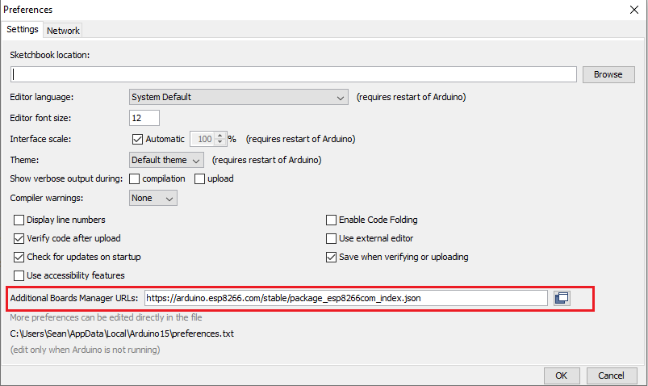
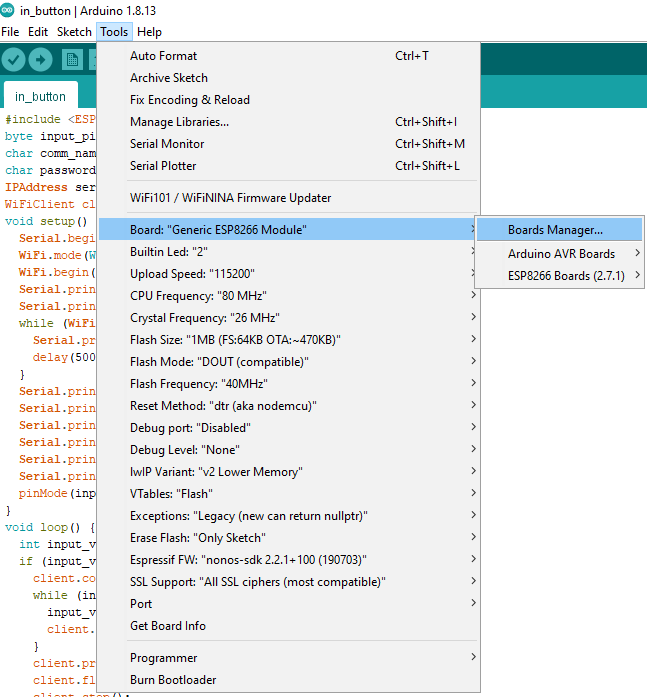
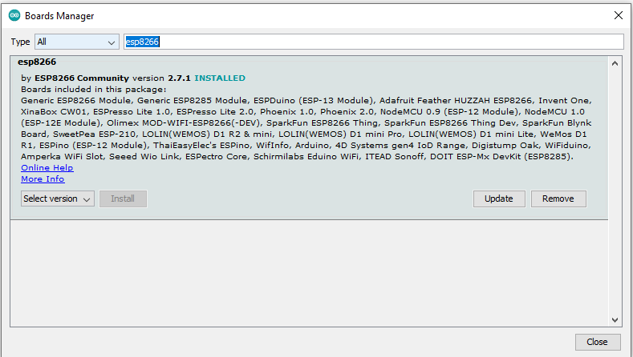
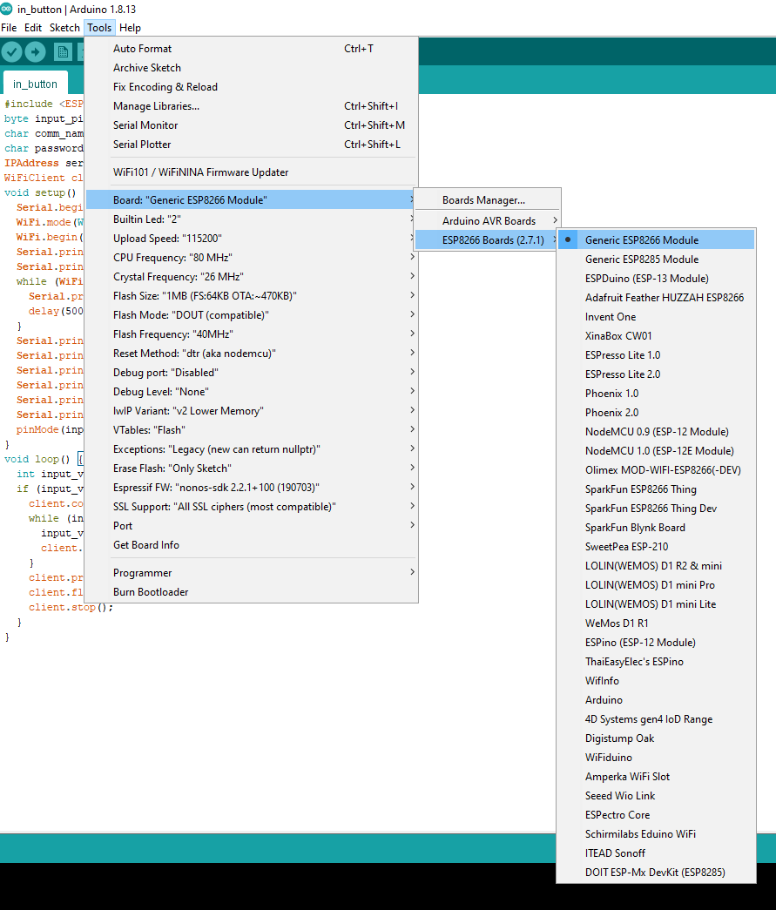
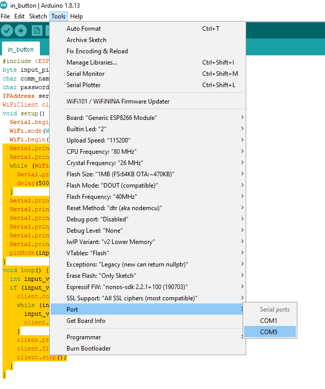
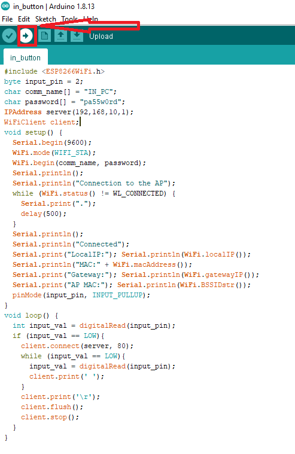
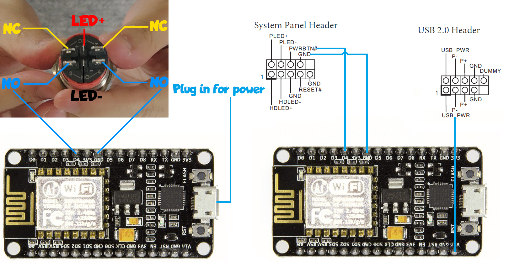

# Remote Button for PC (Wireless)
The repo contains the code required to complete the project described in my youtube video: [Remote Power Button for PC Wired and Wireless](https://www.youtube.com/channel/UCX0ALjR8rwUYkgA3SX-MN-Q?view_as=subscriber)

Please refer to the video for more detailed information regarding to the project.


## Project Guide
The Following is a step-by-step guide for you to make a wireless power button for yourself.

### Step 0:
Download this repo and unzip to your desired location:
```
https://github.com/hamsterworkshop/RemoteButton/archive/master.zip
```

### Step 1:
Download the Arduino IDE, if you do not have one, from the link below and install the IDE following the instructions provided:
```
https://www.arduino.cc/en/main/software
```

### Step 2:
Open the Arduino IDE and add the below link in Additional Boards Manager URLs:
```
https://arduino.esp8266.com/stable/package_esp8266com_index.json
```

File->Preferences-Settings->Additional Boards Manager URLs



### Step 3:
Open Boards Manager:

Tool->Board->Boards Manger


### Step 4:
Search for ESP8266 boards and download the board package:


### Step 5:
Switch to the Generic ESP8266 Module:

Tools->Boards->ESP8266 boards->Generic ESP8266 Module



### Step 6:
Plug in your ESP8266 board and select the correct port(the one appeared after you plug in your board), in my case, it is COM5:



### Step 7:
Compile and upload the code:
find both scripts, the "in_button" one should be connected to your button and the "in_pc" one should be connected to your motherboard.



### Step 8:

Connect your hardwares:


## All DONE!!!
